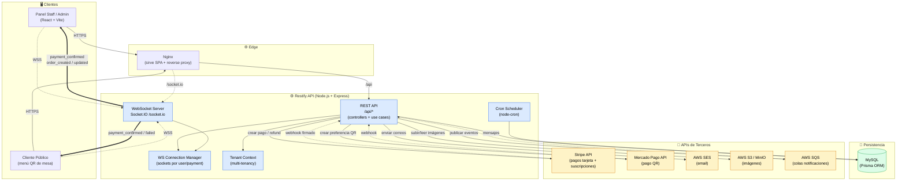
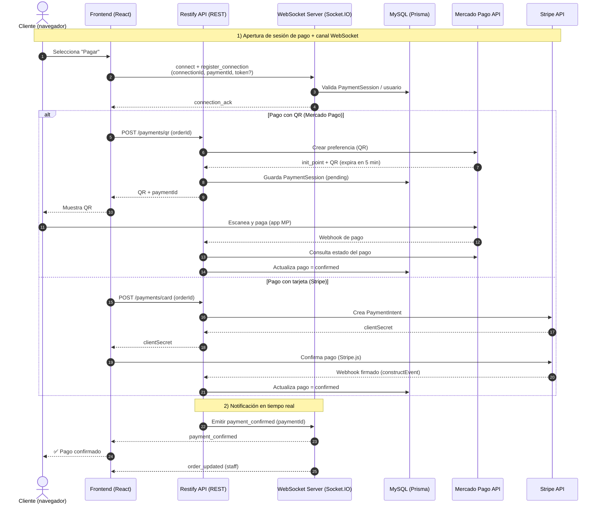

# Arquitectura de Restify — Diagramas

Documento con diagramas de arquitectura de la aplicación **Restify**, incluyendo
WebSockets y las APIs de terceros que integra. Los diagramas están en sintaxis
[Mermaid](https://mermaid.js.org/) y se renderizan directamente en GitHub, VS Code
(con extensión de Mermaid) y la mayoría de visores de Markdown.

## Stack principal

| Capa            | Tecnología                                              |
| --------------- | ------------------------------------------------------- |
| Frontend        | React + Vite + TypeScript (Nginx en prod)               |
| Backend / API   | Node.js + Express + TypeScript (tsyringe DI)            |
| Tiempo real     | Socket.IO (`/socket.io`)                                |
| Base de datos   | MySQL vía Prisma ORM                                     |
| Pagos           | Stripe (tarjeta + suscripciones) · Mercado Pago (QR)    |
| Almacenamiento  | AWS S3 / MinIO (imágenes, apagable con `S3_ENABLED`)    |
| Mensajería      | AWS SQS (notificaciones de pagos y órdenes)             |
| Email           | AWS SES (apagable con `EMAIL_ENABLED`)                  |
| Jobs            | node-cron (limpieza de usuarios no verificados, etc.)   |

---

## Diagrama 1 — Arquitectura general del sistema

Vista de alto nivel: cliente, API, persistencia, WebSockets y servicios de terceros.

**Leyenda de flechas:**
- `——>` línea sólida: petición/llamada síncrona (HTTP/SDK).
- `-.->` línea punteada: comunicación asíncrona o entrante (WebSocket, webhook, cola).
- `==>` línea gruesa: eventos *push* del servidor a los clientes vía WebSocket.

---

## Diagrama 2 — Flujo de pago con WebSockets y APIs de terceros

Secuencia de un pago de orden por QR (Mercado Pago) y por tarjeta (Stripe),
mostrando cómo el cliente recibe la confirmación en tiempo real vía Socket.IO.

### Eventos WebSocket que emite el servidor

| Evento              | Descripción                                   |
| ------------------- | --------------------------------------------- |
| `connection_ack`    | Confirma registro de la conexión              |
| `payment_confirmed` | Pago aprobado                                 |
| `payment_failed`    | Pago rechazado                                |
| `payment_pending`   | Pago pendiente de confirmación                |
| `order_created`     | Nueva orden creada                            |
| `order_updated`     | Orden modificada                              |
| `order_delivered`   | Orden entregada                               |
| `order_canceled`    | Orden cancelada                               |
| `order_new_online`  | Nueva orden online (notifica al staff)        |
| `error`             | Error de validación / autenticación           |

---

## Notas de integración

- **Multi-tenancy:** cada petición resuelve su `Tenant Context`; los datos se aíslan por organización/sucursal (branch).
- **Webhooks de pago:** Stripe valida la firma del webhook (`webhooks.constructEvent`) y su endpoint usa `express.raw`. El webhook de Mercado Pago tiene la validación de firma desactivada por un bug conocido de MP (decisión consciente, no un descuido de seguridad).
- **QR Mercado Pago:** las sesiones de pago por QR expiran en **5 minutos**.
- **Servicios apagables:** `EMAIL_ENABLED` (SES) y `S3_ENABLED` (S3/MinIO) permiten correr en dev/test sin credenciales; cuando están en `false` solo loggean.
- **Colas SQS:** se usan para desacoplar notificaciones de pagos y de órdenes.
- **Cron jobs:** controlados por `RUN_CRONS`; incluyen limpieza de usuarios no verificados.
