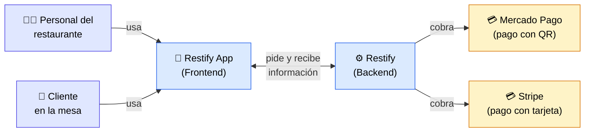
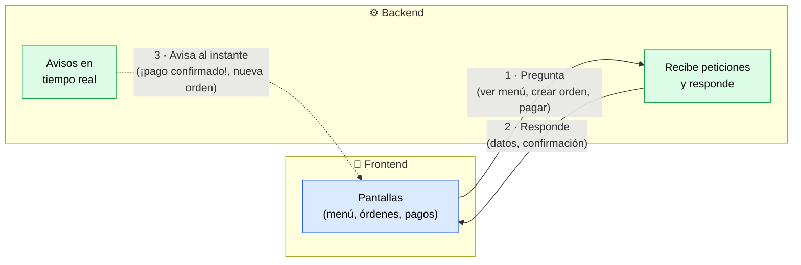
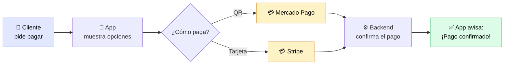

# Restify — Vista General (Simple)

Diagramas pensados para una **vista general fácil de entender**: quién usa el
sistema, cómo habla el frontend con el backend y las dos pasarelas de pago
externas (**Mercado Pago** y **Stripe**). Sintaxis [Mermaid](https://mermaid.js.org/).

---

## Diagrama 1 — ¿Quién usa Restify y cómo se conecta todo?

**Idea clave:** las personas usan la **App**, la App habla con el **Backend**,
y el Backend es el único que se conecta con las pasarelas de pago externas.

---

## Diagrama 2 — Comunicación entre Frontend y Backend

**Idea clave:** normalmente el Frontend **pregunta** y el Backend **responde**.
Además, el Backend puede **avisar al instante** (tiempo real) cuando algo pasa,
como un pago confirmado o una nueva orden.

---

## Diagrama 3 — El proceso de un pago, paso a paso

**Idea clave:** el cliente elige cómo pagar (QR o tarjeta), el pago pasa por la
pasarela externa, el Backend lo confirma y la App avisa al instante.

---

### Resumen en una frase

> Las personas usan la **App**, que habla con el **Backend**; cuando hay que
> cobrar, el Backend usa **Mercado Pago** (QR) o **Stripe** (tarjeta), y avisa
> al instante cuando el pago se confirma.
