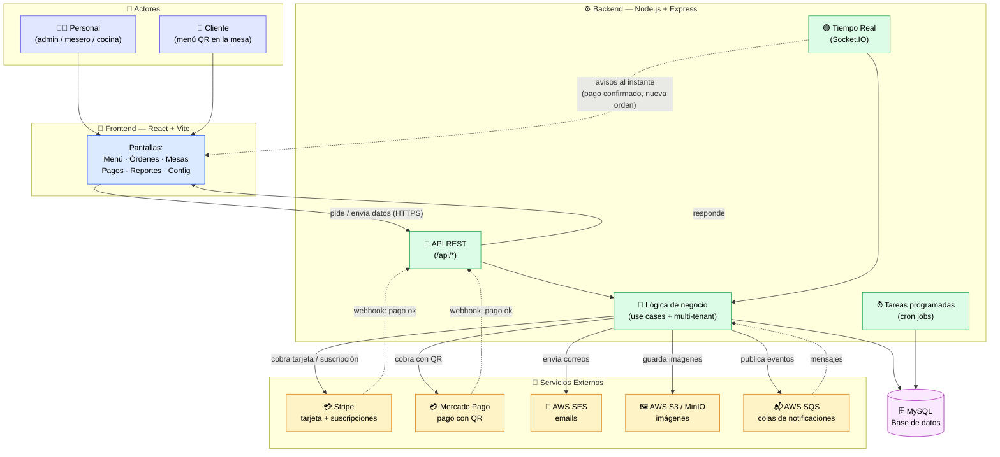

# Restify — Vista Completa del Sistema

Un solo diagrama que muestra **todo el concepto del proyecto** en una vista:
los actores, el frontend, el backend con sus piezas internas, la base de datos,
la comunicación en tiempo real y todas las integraciones externas.
Sintaxis [Mermaid](https://mermaid.js.org/).

---

## Cómo leer el diagrama

| Color        | Qué representa                                              |
| ------------ | ---------------------------------------------------------- |
| 🟣 Morado    | **Actores** — las personas que usan el sistema             |
| 🔵 Azul      | **Frontend** — la app que ven los usuarios                 |
| 🟢 Verde     | **Backend** — el cerebro del sistema y su lógica           |
| 🟪 Lila      | **Base de datos** — donde se guarda toda la información     |
| 🟡 Amarillo  | **Servicios externos** — APIs de terceros que se integran  |

**Tipos de flecha:**
- `——>` línea sólida → petición o llamada directa (alguien pide algo).
- `-.->` línea punteada → comunicación al instante o entrante (tiempo real, webhooks, colas).

## El concepto en una frase

> Los **usuarios** (personal y clientes) usan el **Frontend**, que se comunica con el
> **Backend**; el Backend guarda todo en **MySQL**, avisa al instante por **tiempo real**,
> y se apoya en **servicios externos** para cobrar (**Stripe** y **Mercado Pago**),
> enviar emails, guardar imágenes y procesar notificaciones.
