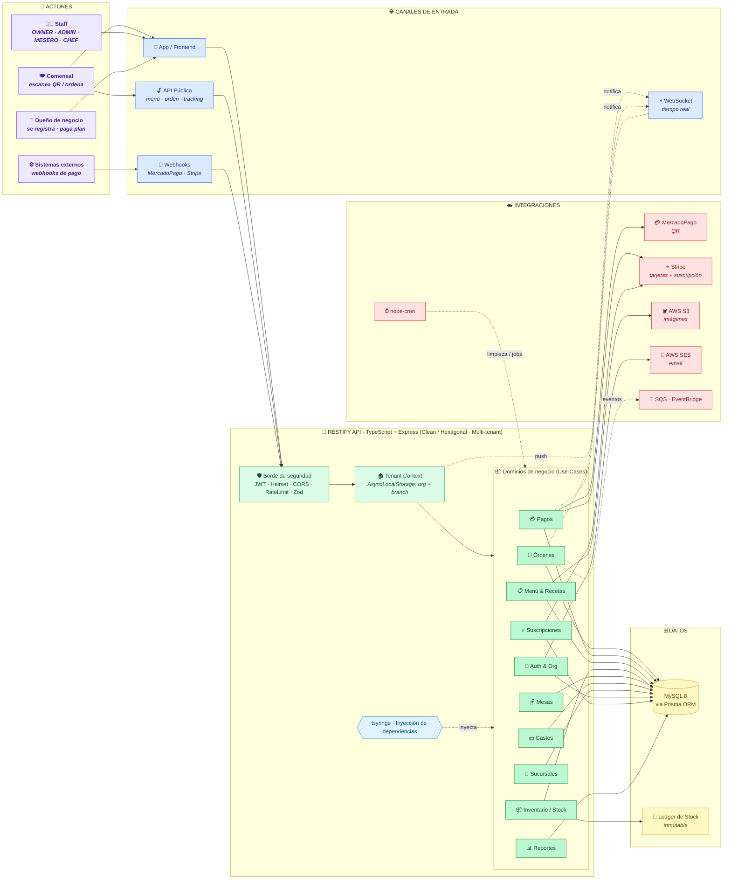
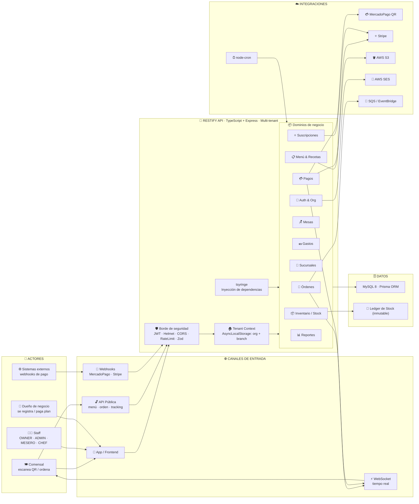
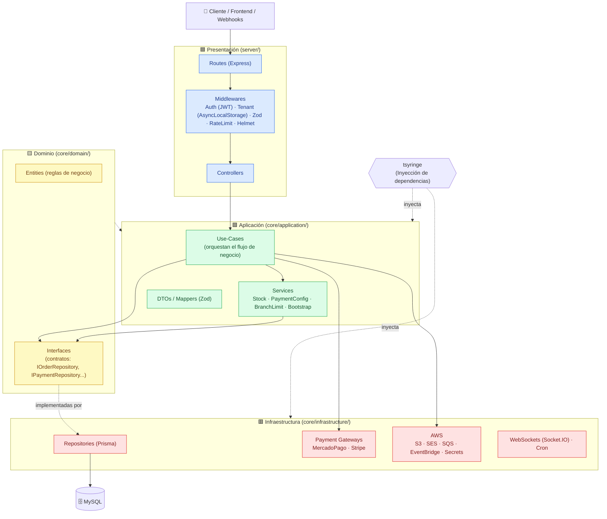
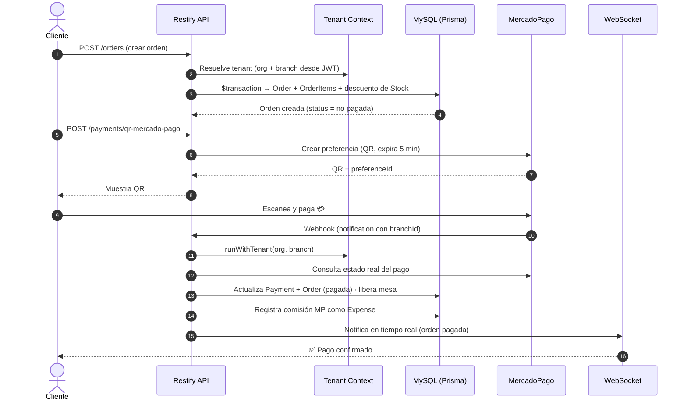
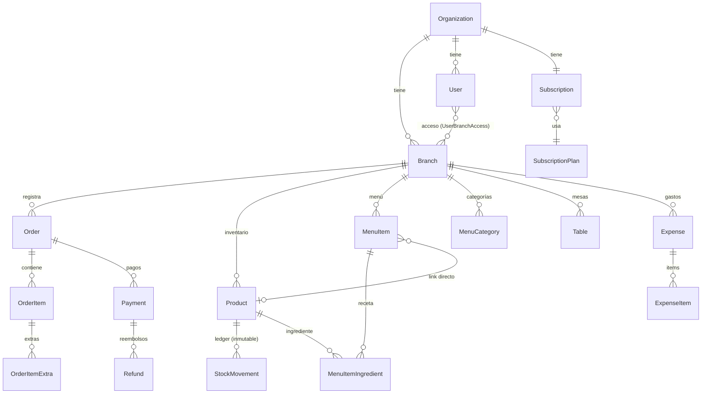
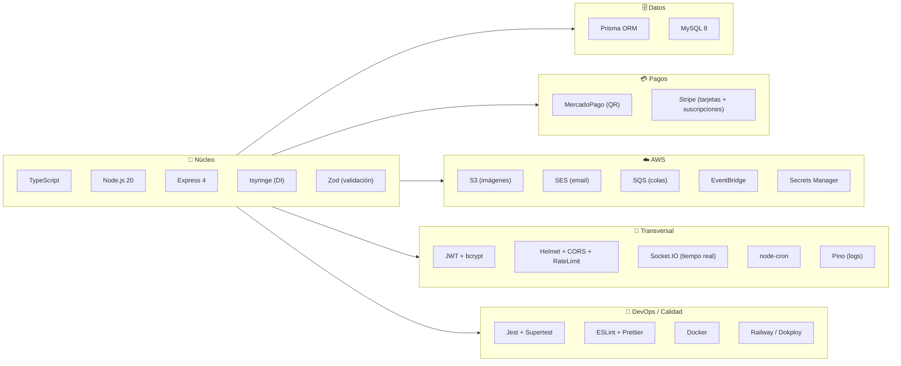

# Restify — Explicación del sistema en 3 diagramas

> Documento pensado para explicar el proyecto **de forma simple y rápida**.
> Contiene una **vista panorámica (overview)** + 3 vistas de detalle: **Arquitectura**, **Funcionamiento** y **Entidades + Tecnologías**.

**Restify** es una API multi-tenant (multi-empresa) para restaurantes: maneja órdenes,
menú, inventario/stock, pagos (MercadoPago QR y Stripe), suscripciones, sucursales y
reportes. Cada organización vive aislada del resto.

---

## 0) Vista panorámica (Overview tipo "mapa") 🗺️

Un solo lienzo con **actores → canales → proceso interno → datos → integraciones**,
para entender todo el sistema de un vistazo (estilo board de Miro).

**Cómo leerlo (izquierda → derecha):** los **actores** entran por distintos **canales** →
toda petición cruza el **borde de seguridad** y se resuelve el **tenant** (qué organización/sucursal) →
se ejecuta el **dominio de negocio** correspondiente → se persiste en **MySQL** y/o se llama a una
**integración externa** (pago, email, storage). Los eventos en **tiempo real** vuelven al cliente por **WebSocket**.

---

### 📌 Versión para importar en Miro (Mermaid simplificado)

> **Cómo usarla:** en Miro → herramienta **Diagrams** → **Mermaid / "Diagram as code"** → pega este bloque → **Create**.
> Es la misma vista panorámica pero **saneada para el importador de Miro**: sin `classDef`/colores,
> sin `direction` en subgraphs y sin flechas encadenadas con `&` (Miro no las procesa).
> Los colores por zona los aplicas en Miro seleccionando cada grupo.

---

## 1) Arquitectura — Clean / Hexagonal por capas

Cómo está organizado el código y cómo viaja una petición HTTP hasta la base de datos.

**Idea clave:** las dependencias apuntan **hacia adentro**. El dominio define *interfaces*
(contratos) y la infraestructura las *implementa*. `tsyringe` conecta todo por inyección
de dependencias. El **aislamiento multi-tenant** se logra con `AsyncLocalStorage`: el JWT
trae el `org`, el `TenantMiddleware` lo guarda en contexto y los repositorios filtran
automáticamente por `organizationId` / `branchId`.

---

## 2) Funcionamiento — Flujo de un pago con QR de MercadoPago

El flujo más representativo del sistema: crear una orden, cobrarla con QR y confirmarla
vía webhook (aplica igual para órdenes públicas, sin login).

**Otros flujos clave (misma lógica de capas):**
- **Signup:** crea Organization (plan FREE) → Subscription → primer Branch → Usuario OWNER, todo en una transacción (`withoutTenant`).
- **Suscripciones:** checkout con Stripe → webhook activa el plan → habilita más sucursales.
- **Stock:** cada venta descuenta inventario por receta o producto directo; movimientos quedan en un ledger inmutable (`StockMovement`).

---

## 3) Entidades y Tecnologías

### 3a) Modelo de datos (entidades principales)

| Entidad | Rol en el sistema |
|---|---|
| **Organization** | Raíz multi-tenant (plan: FREE/PRO/ENTERPRISE) |
| **Subscription / SubscriptionPlan** | Facturación vía Stripe |
| **Branch** | Sucursal (horarios, moneda, config de pagos) |
| **User** | Usuario con rol (OWNER/ADMIN/MANAGER/WAITER/CHEF) |
| **Order / OrderItem / OrderItemExtra** | Órdenes y su detalle |
| **Payment / Refund** | Pagos y reembolsos (estados y gateway) |
| **Product / StockMovement** | Inventario y bitácora de movimientos |
| **MenuItem / MenuCategory / MenuItemIngredient** | Menú y recetas |
| **Table** | Mesas y su disponibilidad |
| **Expense / ExpenseItem** | Gastos (incluye comisión MercadoPago) |

### 3b) Stack tecnológico

---

### Resumen en una frase
> **Restify** es una API en **TypeScript + Express** con **arquitectura limpia/hexagonal**,
> **multi-tenant** (aislamiento por organización/sucursal con `AsyncLocalStorage`),
> persistida en **MySQL vía Prisma**, con pagos **MercadoPago/Stripe**, servicios **AWS**,
> tiempo real con **Socket.IO** y desplegada con **Docker** en **Railway/Dokploy**.
